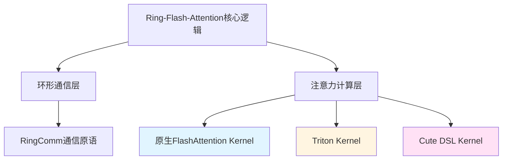
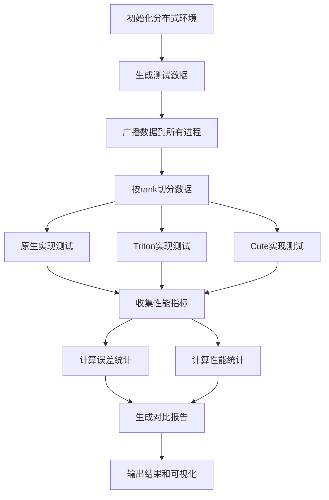

# Ring-Flash-Attention 多实现性能对比设计文档

## 1. 项目背景

当前项目实现了基于FlashAttention的环形注意力机制，使用CUDA后端通过torch.distributed进行跨GPU通信。本设计旨在使用不同底层实现技术重新实现Ring-Flash-Attention，并进行性能对比分析。

### 1.1 现有实现特点

项目当前使用FlashAttention库的CUDA kernel作为计算核心：
- 依赖flash_attn.flash_attn_interface的_flash_attn_forward和_flash_attn_backward
- 使用RingComm实现环形通信模式
- 支持causal mask、window_size、varlen等多种配置
- 在每个通信步骤中调用FlashAttention计算局部注意力块

## 2. 设计目标

实现三种不同技术栈的Ring-Flash-Attention并进行性能对比：
1. **原生方法**：当前项目基于FlashAttention CUDA kernel的实现
2. **Triton实现**：使用Triton DSL重写注意力计算kernel
3. **Cute DSL实现**：使用CUTLASS Cute DSL重写注意力计算kernel

## 3. 技术架构

### 3.1 整体架构设计

三种实现共享相同的高层逻辑结构，差异仅在底层计算kernel：



### 3.2 模块分层设计

| 层级 | 职责 | 实现方式 |
|------|------|----------|
| **接口层** | 提供统一的函数API | ring_flash_attn_func及其变体 |
| **编排层** | 管理多步环形计算流程 | ring_flash_attn_forward/backward |
| **通信层** | 处理KV张量的环形传递 | RingComm类 |
| **计算层** | 执行单块注意力计算 | 三种不同kernel实现 |

## 4. 实现方案

### 4.1 Triton实现方案

#### 4.1.1 Kernel设计

使用Triton Language编写FlashAttention-2风格的分块注意力kernel：

**核心计算单元**：
- Block级别的矩阵乘法和softmax计算
- 在线更新注意力输出和log-sum-exp统计量
- 支持causal mask和数值稳定性优化

**内存访问模式**：
- Q矩阵：按行分块加载（BLOCK_M）
- K矩阵：按列分块加载（BLOCK_N）
- V矩阵：按行分块加载（BLOCK_N）
- 使用shared memory缓存频繁访问的数据块

**并行策略**：
- 程序网格维度：(batch_size, num_heads, num_blocks_m)
- 每个program实例处理一个Q块与所有K块的计算

#### 4.1.2 模块结构

新增模块文件：`ring_flash_attn/triton_ring_flash_attn.py`

包含以下组件：
- `triton_flash_attn_forward_kernel`：前向计算kernel
- `triton_flash_attn_backward_kernel`：反向计算kernel  
- `triton_ring_flash_attn_forward`：环形前向编排函数
- `triton_ring_flash_attn_backward`：环形反向编排函数
- `TritonRingFlashAttnFunc`：autograd.Function封装类
- `triton_ring_flash_attn_func`：顶层API函数

#### 4.1.3 参数配置

Triton kernel关键参数：

| 参数 | 说明 | 典型值 |
|------|------|--------|
| BLOCK_M | Q矩阵行分块大小 | 64或128 |
| BLOCK_N | K/V矩阵分块大小 | 64或128 |
| BLOCK_DMODEL | 头维度分块 | 通常等于head_dim |
| num_warps | 每个block的warp数量 | 4或8 |
| num_stages | 流水线阶段数 | 2或3 |

### 4.2 Cute DSL实现方案

#### 4.2.1 架构设计

基于CUTLASS 3.x的Cute DSL实现高性能attention kernel：

**Cute核心概念应用**：
- **Layout**：定义张量的逻辑形状和物理内存布局
- **Tensor**：将数据指针与Layout绑定形成高级张量抽象
- **TiledMMA**：利用Tensor Core的矩阵乘累加指令
- **Copy Atom**：定义高效的内存拷贝模式

**计算流程**：
1. 使用Cute Layout定义Q/K/V张量的分块视图
2. 利用TiledMMA执行Q@K^T矩阵乘法
3. 使用Cute原语实现softmax和在线统计量更新
4. 利用TiledMMA执行Attention@V矩阵乘法

#### 4.2.2 模块结构

新增以下文件：
- `ring_flash_attn/cute_kernels/`：Cute kernel实现目录
  - `cute_flash_attn.cu`：Cute DSL编写的kernel
  - `cute_flash_attn.h`：kernel头文件
  - `cute_wrapper.cpp`：Python绑定封装
- `ring_flash_attn/cute_ring_flash_attn.py`：Python API层

包含以下Python组件：
- `cute_ring_flash_attn_forward`：环形前向编排
- `cute_ring_flash_attn_backward`：环形反向编排
- `CuteRingFlashAttnFunc`：autograd.Function封装
- `cute_ring_flash_attn_func`：顶层API函数

#### 4.2.3 编译构建

需要修改项目构建配置以支持CUDA/C++扩展：

**setup.py修改要点**：
- 添加CUDA扩展编译配置
- 指定CUTLASS库路径和头文件
- 配置编译标志支持CUDA架构和C++标准
- 添加PyBind11或torch.utils.cpp_extension绑定

**依赖要求**：
- CUTLASS 3.x库
- CUDA Toolkit 11.8+
- 支持Ampere或更新架构的GPU

### 4.3 统一接口设计

为保持一致性，三种实现遵循相同的函数签名：

**核心函数签名**：
```
function_name(
    q: Tensor,
    k: Tensor, 
    v: Tensor,
    dropout_p: float = 0.0,
    softmax_scale: Optional[float] = None,
    causal: bool = False,
    window_size: Tuple[int, int] = (-1, -1),
    alibi_slopes: Optional[Tensor] = None,
    deterministic: bool = False,
    return_attn_probs: bool = False,
    group: Optional[ProcessGroup] = None
) -> Union[Tensor, Tuple[Tensor, Tensor, None]]
```

**函数命名规范**：
- 原生：`ring_flash_attn_func`（已存在）
- Triton：`triton_ring_flash_attn_func`
- Cute DSL：`cute_ring_flash_attn_func`

## 5. 性能对比测试设计

### 5.1 测试文件结构

新增测试文件：`test/test_ring_flash_attn_comparison.py`

### 5.2 测试维度

#### 5.2.1 功能正确性测试

**测试策略**：
- 以原生FlashAttention实现作为ground truth参考
- 对比三种实现的前向输出差异
- 对比三种实现的反向梯度差异

**误差度量**：
- 绝对误差最大值（max absolute error）
- 相对误差（relative error）  
- 均方根误差（RMSE）

**测试用例配置**：

| 配置项 | 数值 |
|--------|------|
| batch_size | 1 |
| sequence_length | 1024, 4096, 8192 |
| num_heads | 32 |
| num_kv_heads | 8 (GQA配置) |
| head_dim | 128 |
| causal | True / False |
| dtype | torch.bfloat16 |

#### 5.2.2 性能基准测试

**测试模式**：
1. 仅前向传播性能（forward_only=True）
2. 前向+反向传播性能（forward_only=False）

**测量指标**：

| 指标 | 说明 | 计算方式 |
|------|------|----------|
| 吞吐量 | 每秒处理迭代数 | iterations / total_time |
| 延迟 | 单次迭代耗时 | total_time / iterations |
| 相对效率 | 相对原生实现的效率 | (impl_throughput / native_throughput) × 100% |
| 内存占用峰值 | GPU显存使用峰值 | torch.cuda.max_memory_allocated() |

**测试参数矩阵**：

| 变量维度 | 测试值 |
|----------|--------|
| 序列长度 | 1024, 2048, 4096, 8192 |
| GPU数量 | 2, 4, 8 |
| 批次大小 | 1, 2 |
| 头维度 | 64, 128 |

### 5.3 测试流程设计



### 5.4 测试执行逻辑

#### 5.4.1 单次测试函数

**功能**：执行单个实现的完整测试并返回结果

**输入参数**：
- 实现函数引用
- 输入张量（q, k, v）
- 测试配置参数
- 性能测试模式标志

**输出结果**：
- 前向输出张量
- LSE统计量
- 反向梯度张量
- 性能计时数据
- 内存使用数据

#### 5.4.2 对比测试主函数

**职责**：
1. 初始化torch.distributed进程组
2. 准备一致的测试数据集
3. 依次调用三种实现的测试
4. 收集所有结果并进行对比分析
5. 在rank 0进程汇总并输出报告

**同步机制**：
- 使用dist.barrier()确保所有进程同步
- 使用dist.broadcast()同步测试数据
- 仅在rank 0进程输出日志和报告

### 5.5 基准测试文件

新增基准测试文件：`benchmark/benchmark_comparison.py`

**设计要点**：
- 复用现有benchmark_kvpacked_func.py的框架结构
- 扩展支持三种实现的性能测试
- 支持不同配置参数的性能扫描
- 生成性能对比表格和图表

**配置参数**：
- 默认使用Llama3-8B配置（seqlen=8192, num_heads=32, head_dim=128）
- 支持通过命令行参数调整测试配置
- 支持启用torch profiler进行细粒度分析

## 6. 输出结果设计

### 6.1 测试报告格式

**正确性测试报告**：

表格形式展示误差统计：

| 实现 | 输出Max Error | 输出RMSE | LSE Max Error | 梯度Max Error |
|------|---------------|----------|---------------|---------------|
| Triton vs 原生 | 数值 | 数值 | 数值 | 数值 |
| Cute vs 原生 | 数值 | 数值 | 数值 | 数值 |

**性能测试报告**：

表格形式展示性能对比：

| 实现 | 前向吞吐量 (iter/s) | 前向+反向吞吐量 (iter/s) | 相对效率 | 内存峰值 (GB) |
|------|---------------------|-------------------------|----------|---------------|
| 原生FlashAttention | 数值 | 数值 | 100% | 数值 |
| Triton | 数值 | 数值 | 百分比 | 数值 |
| Cute DSL | 数值 | 数值 | 百分比 | 数值 |

### 6.2 可视化输出

**性能对比图表**：
- 柱状图：三种实现在不同序列长度下的吞吐量对比
- 折线图：吞吐量随序列长度变化趋势
- 热力图：不同配置参数组合下的性能表现

**误差分布图表**：
- 直方图：输出误差的分布情况
- 箱线图：不同测试配置下的误差范围

## 7. 实现优先级与里程碑

### 7.1 开发阶段划分

**阶段一：Triton实现**（优先级：高）
- 实现Triton版本的forward和backward kernel
- 封装为统一API接口
- 通过正确性测试

**阶段二：Cute DSL实现**（优先级：中）
- 实现Cute版本的CUDA kernel
- 配置编译构建流程
- 实现Python绑定
- 通过正确性测试

**阶段三：对比测试框架**（优先级：高）
- 实现正确性测试用例
- 实现性能基准测试
- 实现结果统计和报告生成

**阶段四：优化与调优**（优先级：低）
- 针对性能瓶颈进行kernel优化
- 调整分块参数和并行策略
- 补充更多测试场景

### 7.2 验收标准

**正确性标准**：
- 输出误差相对值 < 1e-2（bfloat16精度）
- 梯度误差相对值 < 5e-2
- 所有测试配置下结果一致

**性能标准**：
- Triton实现相对原生FlashAttention效率 > 60%
- Cute DSL实现相对原生FlashAttention效率 > 70%
- 内存开销增长 < 20%

**工程标准**：
- 代码风格符合项目规范
- 通过所有单元测试
- 完善的文档和注释

## 8. 技术风险与挑战

### 8.1 Triton实现挑战

| 挑战 | 影响 | 缓解措施 |
|------|------|----------|
| 性能优化难度 | Triton自动优化可能不及手写CUDA | 多版本kernel尝试，调优分块参数 |
| 数值稳定性 | softmax计算易出现溢出 | 使用在线softmax算法和数值稳定技巧 |
| 内存管理 | 共享内存使用限制 | 优化数据复用策略，减少内存占用 |

### 8.2 Cute DSL实现挑战

| 挑战 | 影响 | 缓解措施 |
|------|------|----------|
| 学习曲线陡峭 | Cute DSL概念抽象复杂 | 参考CUTLASS官方示例，逐步理解 |
| 编译配置复杂 | CUDA扩展构建易出错 | 明确依赖版本，提供详细构建文档 |
| 调试困难 | 编译期错误信息晦涩 | 分步实现，充分单元测试 |

### 8.3 分布式测试挑战

| 挑战 | 影响 | 缓解措施 |
|------|------|----------|
| 多GPU环境依赖 | 测试需要多卡资源 | 支持最小2卡配置，提供单机多GPU方案 |
| 通信开销影响 | 纯计算性能难以隔离 | 增加仅kernel层面的微基准测试 |
| 随机性和可重复性 | 结果波动影响对比 | 固定随机种子，多次运行取平均 |

## 9. 扩展性考虑

### 9.1 未来优化方向

**Kernel层优化**：
- 支持更多数据类型（fp16, fp8）
- 实现专用的GQA优化kernel
- 支持稀疏注意力模式

**通信层优化**：
- 探索通信与计算重叠优化
- 支持更灵活的分区策略
- 集成NCCL自定义通信原语

**易用性增强**：
- 自动化参数调优工具
- 可视化性能分析dashboard
- 集成到HuggingFace Trainer

### 9.2 兼容性规划

**硬件兼容**：
- 支持Ampere、Hopper架构GPU
- 适配不同计算能力等级
- 提供CPU fallback（仅测试用）

**软件兼容**：
- 兼容PyTorch 2.0+版本
- 支持torch.compile编译优化
- 兼容现有模型训练框架

## 10. 项目交付物

### 10.1 代码模块

- `ring_flash_attn/triton_ring_flash_attn.py`：Triton实现
- `ring_flash_attn/cute_ring_flash_attn.py`：Cute实现Python接口
- `ring_flash_attn/cute_kernels/`：Cute kernel源码
- `test/test_ring_flash_attn_comparison.py`：对比测试用例
- `benchmark/benchmark_comparison.py`：性能基准测试

### 10.2 文档

- 实现方案技术文档
- 性能测试报告
- API使用说明
- 编译构建指南

### 10.3 测试结果

- 正确性测试输出日志
- 性能基准测试数据表格
- 可视化对比图表
- 不同配置下的性能profile文件
